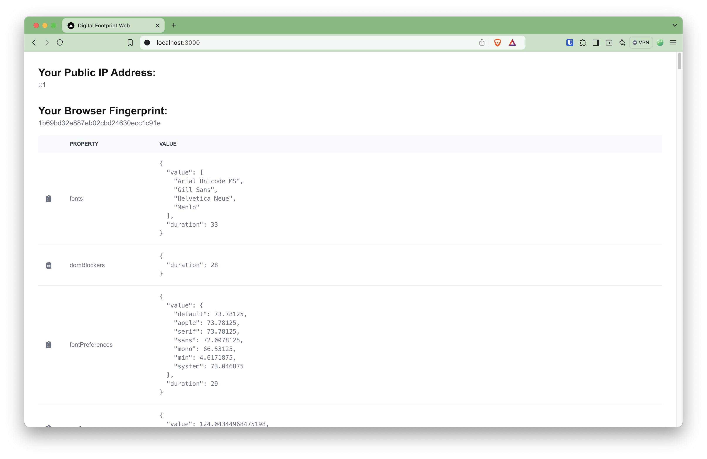

# Digital Footprint Web

## Installation

```
pnpm i
```

## Running the app

```
pnpm dev
```

## Building the app

```
pnpm build
```

## Preview



## Technologies & IDE

<div>
     &nbsp;
     &nbsp;
     &nbsp;
     &nbsp;
   
</div>
